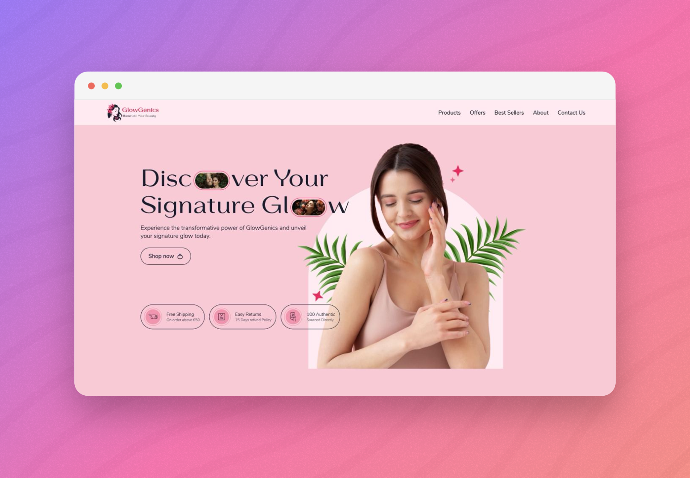

# [beauty-glow-landing][web-url]

[Beauty website][web-url] built with [Sass] and JavaScript using [BEM] methodology.

[web-url]: https://a-sokolova-dev.github.io/beauty-glow-landing/
[Sass]: https://sass-lang.com/
[BEM]: https://getbem.com/

## 🚀 Preview



> Preview generated with [pika.style](https://pika.style/).

## 🎯 Lighthouse Metrics


## 🛠️ Technologies

- [sass](https://sass-lang.com/)
- [vite](https://vitejs.dev/)
- [eslint](https://eslint.org/)
- [stylelint](https://stylelint.io/)

## ✨ Getting Started

### Clone the project using one of these ways:

1. [Fork](https://github.com/a-sokolova-dev/beauty-glow-landing/fork) the repository

2. Clone the repository locally

```bash
git clone https://github.com/a-sokolova-dev/beauty-glow-landing
cd beauty-glow-landing
```

### Install dependencies

```bash
npm install
```

### Run the project

```bash
npm run dev
```

Open [http://localhost:5173/](http://localhost:5173/) with your browser to see the result.
